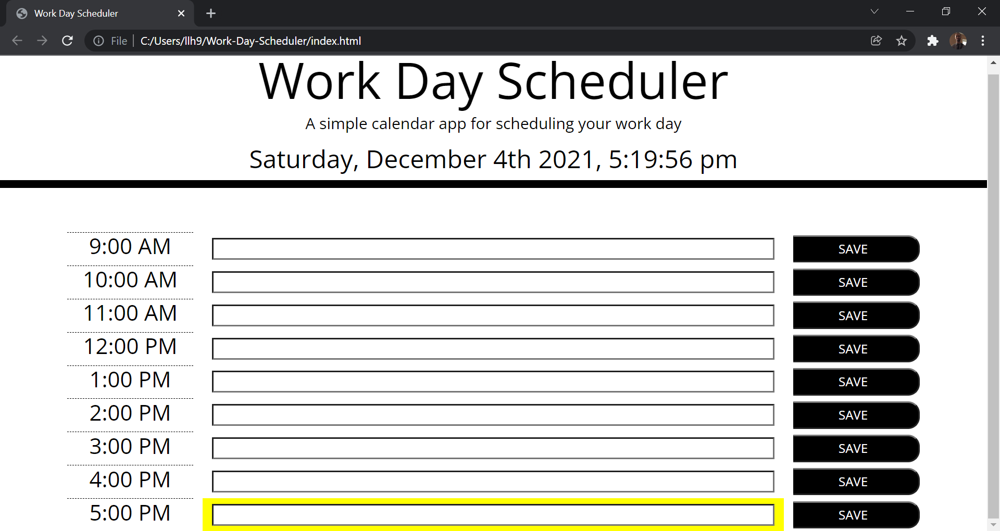

# Work Day Scheduler 

    
## [Description](#description)
    
The task for this project was to Create a simple calendar application that allows a user to save events for each hour of the day by modifying starter code. This app will run in the browser and feature dynamically updated HTML and CSS powered by jQuery.
    
### Motivation
    
The motivation for this project comes from the need for employees of a given buisness to keep track of their daily tasks. 
    
### Problems Solved 
    
One of the problems I encountered was how to generate all the components of this app using loops. The way I provided a solution to this problem was to implement a mathmatical formula that works with the for-loop to generate each part of the app. 
    
### What I learned 
    
From completing this project, I learned how to use third party web APIs and incoporate them into a single app. 
    
## [Table of Contents](#table-of-contents)
    
1. [Usage](#usage)
    
1. [Demo](#demo)
    
1. [Test](#test)
    
1. [Badges](#badges)
    
1. [Features](#features)
    
1. [Contributors](#contributors)
    
1. [Questions](#questions)
    
1. [License](#license)
    
## [Usage](#usage)
    
A given employee would use this application by going to the website from a browser, entering daily tasks, and saving tasks as they are entered which will save those tasks into local storage. 
    
### [Demo Screenshot 1](#demo-screenshot-1)
    

    
## [Test](#test)
    
After completion of the application each of the features were manually tested to insure proper operation
    
## [Badges](#badges)
    

    
You can get badges hosted by [shields.io](https://shields.io/). 
    
## [Contributors](#contributors)
    
Landon Hinkle
    
## [Questions](#questions)
    
Email me at llh9@yahoo.com

### Repository link

[https://github.com/llh9/README-Gnerator](https://github.com/llh9/README-Gnerator)
    
## [License](#license)
    
ISC
    